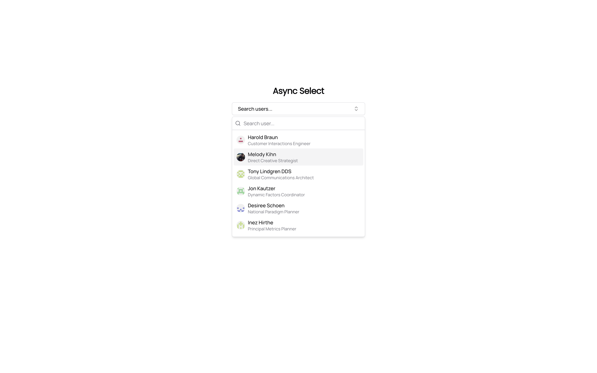

# Async Select Component

A modern, accessible, and customizable async select component for React applications. Built with TypeScript and ShadCN UI components.



## Installation

The Async Select is built using a composition of the `<Popover />` and the `<Command />` components from [ShadCN UI](https://ui.shadcn.com/docs).

See installation instructions for the [Popover](https://ui.shadcn.com/docs/components/popover#installation) and the [Command](https://ui.shadcn.com/docs/components/command#installation) components.

## Basic Usage

```tsx
import { AsyncSelect } from "@/components/async-select";

function MyComponent() {
  const [value, setValue] = useState("");

  return (
    <AsyncSelect<DataType>
      fetcher={fetchData}
      renderOption={(item) => <div>{item.name}</div>}
      getOptionValue={(item) => item.id}
      getDisplayValue={(item) => item.name}
      label="Select"
      value={value}
      onChange={setValue}
    />
  );
}
```

## Props

### Required Props

| Prop | Type | Description |
|------|------|-------------|
| `fetcher` | `(query?: string) => Promise<T[]>` | Async function to fetch options |
| `renderOption` | `(option: T) => React.ReactNode` | Function to render each option in the dropdown |
| `getOptionValue` | `(option: T) => string` | Function to get unique value from option |
| `getDisplayValue` | `(option: T) => React.ReactNode` | Function to render selected value |
| `value` | `string` | Currently selected value |
| `onChange` | `(value: string) => void` | Callback when selection changes |
| `label` | `string` | Label for the select field |

### Optional Props

| Prop | Type | Default | Description |
|------|------|---------|-------------|
| `preload` | `boolean` | `false` | Enable preloading all options |
| `filterFn` | `(option: T, query: string) => boolean` | - | Custom filter function for preload mode |
| `notFound` | `React.ReactNode` | - | Custom not found message/component |
| `loadingSkeleton` | `React.ReactNode` | - | Custom loading state component |
| `placeholder` | `string` | "Select..." | Placeholder text |
| `disabled` | `boolean` | `false` | Disable the select |
| `width` | `string \| number` | "200px" | Custom width |
| `className` | `string` | - | Custom class for popover |
| `triggerClassName` | `string` | - | Custom class for trigger button |
| `noResultsMessage` | `string` | - | Custom no results message |
| `clearable` | `boolean` | `true` | Allow clearing selection |

## Examples

### Async Mode

```tsx
<AsyncSelect<User>
  fetcher={searchUsers}
  renderOption={(user) => (
    <div className="flex items-center gap-2">
      <Image
        src={user.avatar}
        alt={user.name}
        width={24}
        height={24}
        className="rounded-full"
      />
      <div className="flex flex-col">
        <div className="font-medium">{user.name}</div>
        <div className="text-xs text-muted-foreground">{user.role}</div>
      </div>
    </div>
  )}
  getOptionValue={(user) => user.id}
  getDisplayValue={(user) => (
    <div className="flex items-center gap-2">
      <Image
        src={user.avatar}
        alt={user.name}
        width={24}
        height={24}
        className="rounded-full"
      />
      <div className="flex flex-col">
        <div className="font-medium">{user.name}</div>
        <div className="text-xs text-muted-foreground">{user.role}</div>
      </div>
    </div>
  )}
  notFound={<div className="py-6 text-center text-sm">No users found</div>}
  label="User"
  placeholder="Search users..."
  value={selectedUser}
  onChange={setSelectedUser}
  width="375px"
/>
```

### Preload Mode

```tsx
<AsyncSelect<User>
  fetcher={searchAllUsers}
  preload
  filterFn={(user, query) => user.name.toLowerCase().includes(query.toLowerCase())}
  renderOption={(user) => (
    <div className="flex items-center gap-2">
      <Image
        src={user.avatar}
        alt={user.name}
        width={24}
        height={24}
        className="rounded-full"
      />
      <div className="flex flex-col">
        <div className="font-medium">{user.name}</div>
        <div className="text-xs text-muted-foreground">{user.role}</div>
      </div>
    </div>
  )}
  getOptionValue={(user) => user.id}
  getDisplayValue={(user) => user.name}
  label="User"
  value={selectedUser}
  onChange={setSelectedUser}
/>
```

## TypeScript Interface

```tsx
interface AsyncSelectProps<T> {
  fetcher: (query?: string) => Promise<T[]>;
  preload?: boolean;
  filterFn?: (option: T, query: string) => boolean;
  renderOption: (option: T) => React.ReactNode;
  getOptionValue: (option: T) => string;
  getDisplayValue: (option: T) => React.ReactNode;
  notFound?: React.ReactNode;
  loadingSkeleton?: React.ReactNode;
  value: string;
  onChange: (value: string) => void;
  label: string;
  placeholder?: string;
  disabled?: boolean;
  width?: string | number;
  className?: string;
  triggerClassName?: string;
  noResultsMessage?: string;
  clearable?: boolean;
}
```
